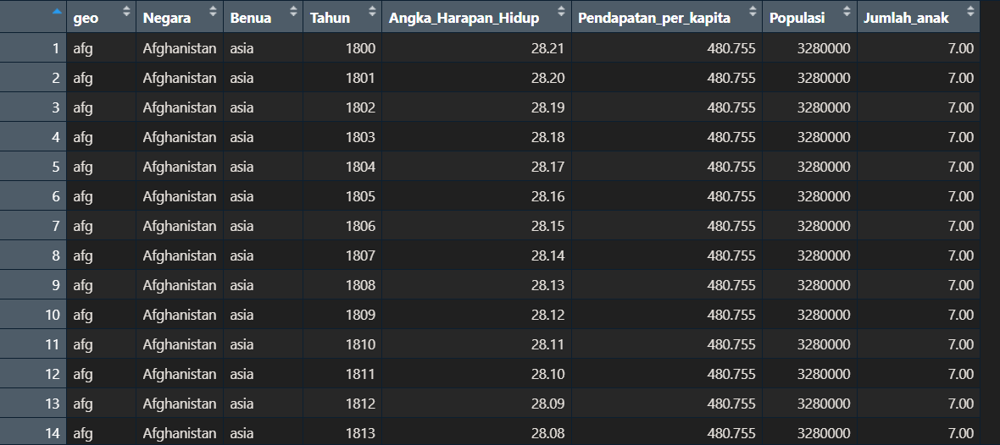

```{=html}
<style>
body{
text-align: justify}
</style>
```
```{r setup, include=FALSE}
knitr::opts_chunk$set(echo = TRUE)
```

# Pengantar Visualisasi Data dengan ggplot2 dan plotly dalam R  

Visualisasi data merupakan salah satu langkah penting dalam analisis data untuk memahami pola, distribusi, serta hubungan antar variabel. Dalam R, terdapat berbagai paket yang dapat digunakan untuk visualisasi, dan dua yang paling populer adalah ggplot2 dan plotly.  

- ggplot2: Paket ini berbasis pada konsep Grammar of Graphics, memungkinkan pembuatan grafik yang sistematis dan fleksibel dengan berbagai elemen visual seperti geometri, skala, dan estetika. Dengan ggplot2, kita dapat dengan mudah membuat histogram, grafik batang, serta berbagai bentuk visualisasi lainnya yang statis namun sangat informatif.  

- plotly: Berbeda dengan ggplot2, paket ini memungkinkan pembuatan grafik interaktif, termasuk 3D scatter plots dan animasi berbasis waktu. Dengan plotly, kita dapat mengeksplorasi data secara dinamis, memperbesar area tertentu, serta menampilkan informasi tambahan dalam bentuk tooltip.  

Pada analisis ini, kita akan menggunakan kedua paket tersebut untuk mengeksplorasi hubungan antara Angka Harapan Hidup, Pendapatan per Kapita, Populasi, dan Benua. Berbagai jenis visualisasi yang akan dibuat meliputi:  

1. Histogram → Untuk melihat distribusi angka harapan hidup.  
2. Bar Chart → Untuk membandingkan rata-rata angka harapan hidup antar benua.  
3. 3D Scatter Plot → Untuk memahami hubungan antara pendapatan, angka harapan hidup, dan populasi dalam ruang tiga dimensi.  
4. Animated Scatter Plot → Untuk melihat perubahan hubungan variabel-variabel tersebut dari waktu ke waktu.  

Dengan menggunakan pendekatan ini, kita dapat memperoleh wawasan lebih dalam mengenai bagaimana faktor ekonomi dan demografi berkontribusi terhadap kualitas hidup di berbagai negara dan benua.  


```{r}
library(readr)
Data <- read_csv("Data.csv", show_col_types = FALSE)
View(Data)
```
Mengubah data ke CSV danMenampilkan Data CSV




# 1  Univariat
Judul: Distribusi Angka Harapan Hidup
Tahapan untuk Menyusun Grafik:

1.Gunakan library ggplot2 untuk membuat visualisasi.

2.Gunakan fungsi ggplot() untuk memetakan variabel Angka_Harapan_Hidup pada sumbu X.

3.Tambahkan layer geom_histogram() untuk membuat histogram.

4.Tentukan parameter binwidth, fill, dan color untuk estetika.

5.Gunakan labs() untuk menambahkan judul dan label sumbu.

Label Sumbu:

X: Angka Harapan Hidup

Y: Frekuensi

Interpretasi Grafik:
Histogram ini menunjukkan distribusi angka harapan hidup di dataset. Rentang nilai Angka_Harapan_Hidup dibagi menjadi interval dengan lebar 5. Dari grafik ini, kita dapat melihat rentang nilai yang paling sering muncul. Contoh: Jika rentang 70-75 memiliki puncak tertinggi, maka mayoritas negara memiliki angka harapan hidup di rentang tersebut.


```{r}
library(ggplot2)

# Membuat histogram
ggplot(Data, aes(x = Angka_Harapan_Hidup)) +
  geom_histogram(binwidth = 5, fill = "skyblue", color = "black") +
  labs(
    title = "Distribusi Angka Harapan Hidup",
    x = "Angka Harapan Hidup",
    y = "Frekuensi"
  ) +
  theme_minimal()

```

# 2 Bivariat
Judul: Rata-rata Angka Harapan Hidup per Benua
Tahapan untuk Menyusun Grafik:

1 Pemetaan Data: aes(x = Benua, y = Angka_Harapan_Hidup): Memetakan Benua pada sumbu X dan Angka_Harapan_Hidup pada sumbu Y.Gunakan fill = Benua untuk memberikan warna berbeda pada setiap kategori benua.

2 Statistik: stat_summary(fun = "mean", geom = "bar"): Menampilkan rata-rata Angka_Harapan_Hidup untuk setiap benua dalam bentuk bar.

3 Visualisasi: geom = "bar" untuk menampilkan grafik batang. width = 0.6 untuk mengatur lebar batang agar lebih rapi.

4 Label dan Judul: Gunakan labs() untuk menambahkan judul dan label sumbu yang relevan.

5 Estetika: Warna batang diatur berdasarkan benua menggunakan parameter fill.
.

Label Sumbu:

X: Benua

Y: Rata-rata Angka Harapan Hidup

Interpretasi Grafik:
Grafik ini menampilkan rata-rata angka harapan hidup untuk setiap benua.
Perbandingan antar batang memudahkan identifikasi benua dengan angka harapan hidup tertinggi dan terendah.
Contoh: Jika benua dengan batang tertinggi adalah Eropa, berarti benua ini memiliki rata-rata angka harapan hidup tertinggi dibandingkan benua lain.

```{r}
ggplot(Data, aes(x = Benua, y = Angka_Harapan_Hidup, fill = Benua)) +
  stat_summary(fun = "mean", geom = "bar", width = 0.6) +
  labs(
    title = "Rata-rata Angka Harapan Hidup per Benua",
    x = "Benua",
    y = "Rata-rata Angka Harapan Hidup",
    fill = "Benua"
  ) +
  theme_minimal()

```

# 3 Mltivariat 
3D Scatter Plot: Pendapatan, Angka Harapan Hidup, dan Populasi

Penjelasan Tahapan :

1. Menggunakan plot_ly():
x = ~Pendapatan_per_kapita: Data sumbu X adalah Pendapatan per Kapita.

y = ~Angka_Harapan_Hidup: Data sumbu Y adalah Angka Harapan Hidup.

z = ~Populasi: Data sumbu Z adalah Populasi.

color = ~Benua: Warna titik ditentukan oleh kategori benua.

2. Interaktivitas:
text: Tooltip menampilkan informasi tambahan saat titik diklik atau diarahkan dengan kursor.

Anda dapat menyertakan informasi penting seperti nama negara, populasi, dan pendapatan.

3. Parameter Grafik:
type = "scatter3d": Menentukan tipe grafik sebagai 3D scatter plot.

mode = "markers": Menggunakan marker (titik) untuk merepresentasikan data.

marker = list(size = 5, opacity = 0.7): Menyesuaikan ukuran dan transparansi titik.

4. Layout:
layout(): Menambahkan judul dan label pada sumbu X, Y, dan Z.

scene: Menentukan pengaturan untuk sumbu 3D.

Interpretasi Grafik:
Grafik ini menunjukkan hubungan antara Pendapatan per Kapita, Angka Harapan Hidup, dan Populasi.

Sumbu X: Pendapatan per Kapita (kekayaan rata-rata per orang di suatu negara).

Sumbu Y: Angka Harapan Hidup (indikator kesehatan dan kualitas hidup).

Sumbu Z: Populasi (jumlah total penduduk negara).

Warna titik menunjukkan benua masing-masing negara, memudahkan analisis per kawasan.

```{r}
suppressPackageStartupMessages(library(plotly))

fig <- plot_ly(
  data = Data,
  x = ~Pendapatan_per_kapita,
  y = ~Angka_Harapan_Hidup,
  z = ~Populasi,
  type = "scatter3d",
  mode = "markers",
  color = ~Benua,
  marker = list(size = 5, opacity = 0.7),
  text = ~paste(
    "Negara:", Negara,
    "<br>Pendapatan per Kapita:", Pendapatan_per_kapita,
    "<br>Angka Harapan Hidup:", Angka_Harapan_Hidup,
    "<br>Populasi:", Populasi
  )
)

fig <- fig %>%
  layout(
    title = "3D Scatter Plot: Pendapatan, Angka Harapan Hidup, dan Populasi",
    scene = list(
      xaxis = list(title = "Pendapatan per Kapita"),
      yaxis = list(title = "Angka Harapan Hidup"),
      zaxis = list(title = "Populasi")
    )
  )

fig

```

# 4 Interaktif 

Judul : Perubahan Dari Tahun Ke Tahun

Penjelasan Tahapan :

1 Memuat Library : library(plotly)

2 Menonaktifkan Peringatan (Opsional) : options(warn = -1)

3 Membuat Plot Interaktif dengan plot_ly() : fig <- plot_ly(Data,

4 Menentukan Sumbu X dan Y : x = ~Pendapatan_per_kapita, 
y = ~Angka_Harapan_Hidup, 

5 Menambahkan Variabel Tambahan untuk Analisis Multivariat :size = ~Populasi, 
color = ~Benua, 
frame = ~Tahun,

6 Menambahkan Informasi Tambahan pada Titik Data : text = ~paste("Negara:", Negara, 
              "<br>Pendapatan:", Pendapatan_per_kapita, 
              "<br>Harapan Hidup:", Angka_Harapan_Hidup, 
              "<br>Populasi:", Populasi),
              
7 Menentukan Tipe dan Mode Grafik : type = 'scatter', 
mode = 'markers'

8 Menyesuaikan Tata Letak (layout()) : layout(title = "Perubahan Multivariat dari Tahun ke Tahun",
       xaxis = list(title = "Pendapatan Per Kapita"),
       yaxis = list(title = "Angka Harapan Hidup"))
       
9 Menampilkan Grafik : fig

Interpretasi Grafik :

Grafik ini adalah animasi interaktif yang menampilkan perubahan hubungan antara Pendapatan per Kapita dan Angka Harapan Hidup dari waktu ke waktu.

Setiap titik mewakili sebuah negara, dengan:
Ukuran titik menunjukkan populasi negara tersebut.
Warna titik menunjukkan benua asal negara tersebut.

Pengguna dapat melihat perkembangan indikator ekonomi dan kesehatan seiring waktu dengan menggerakkan animasi berdasarkan variabel Tahun.

```{r}
library(plotly)
options(warn = -1)

fig <- plot_ly(Data, 
               x = ~Pendapatan_per_kapita, 
               y = ~Angka_Harapan_Hidup, 
               size = ~Populasi, 
               color = ~Benua, 
               frame = ~Tahun, 
               text = ~paste("Negara:", Negara, 
                             "<br>Pendapatan:", Pendapatan_per_kapita, 
                             "<br>Harapan Hidup:", Angka_Harapan_Hidup, 
                             "<br>Populasi:", Populasi),
               type = 'scatter', 
               mode = 'markers') %>% 
  layout(title = "Perubahan Multivariat dari Tahun ke Tahun",
         xaxis = list(title = "Pendapatan Per Kapita"),
         yaxis = list(title = "Angka Harapan Hidup"))

fig
```

# Kesimpulan dari Visualisasi Data dalam R

Dari beberapa visualisasi yang telah dibuat menggunakan ggplot2 dan plotly, kita dapat mengambil beberapa kesimpulan mengenai hubungan antara Angka Harapan Hidup, Pendapatan per Kapita, Populasi, dan Benua.  

1. Histogram: Distribusi Angka Harapan Hidup  
(Kode 1: ggplot Histogram)
- Histogram membantu kita melihat distribusi angka harapan hidup di berbagai negara dan tahun.  
- Dari visualisasi ini, kita dapat mengetahui apakah angka harapan hidup terdistribusi normal atau cenderung miring ke kiri/kanan.  
- Binwidth = 5 digunakan untuk mengelompokkan data dengan interval 5 tahun agar lebih mudah dianalisis.  

2. Bar Chart: Rata-rata Angka Harapan Hidup per Benua
(Kode 2: ggplot Bar Chart)
- Visualisasi ini menunjukkan rata-rata angka harapan hidup di setiap benua.  
- Dengan menggunakan `stat_summary(fun = "mean")`, kita dapat membandingkan angka harapan hidup antar-benua.  
- Warna pada grafik juga membantu membedakan masing-masing benua dengan lebih jelas.  
- Dari grafik ini, kita dapat melihat apakah ada benua dengan angka harapan hidup yang jauh lebih tinggi atau rendah dibandingkan yang lain.  

3. 3D Scatter Plot: Hubungan Pendapatan, Angka Harapan Hidup, dan Populasi
(Kode 3: plotly Scatter 3D)
- Grafik ini menggunakan sumbu X (Pendapatan per Kapita), sumbu Y (Angka Harapan Hidup), dan sumbu Z (Populasi).  
- Dengan menambahkan warna berdasarkan benua, kita dapat melihat apakah ada pola tertentu antar-benua.  
- Dari grafik ini, kita dapat melihat bahwa negara dengan pendapatan lebih tinggi cenderung memiliki angka harapan hidup lebih tinggi.  
- Ukuran titik tidak ditentukan oleh variabel lain, tetapi tetap seragam dengan `size = 5`.  

4. Animated Scatter Plot: Perubahan Multivariat dari Tahun ke Tahun
(Kode 4: plotly Animated Scatter Plot)  
- Visualisasi ini menampilkan perubahan angka harapan hidup dan pendapatan per kapita secara dinamis dari tahun ke tahun.  
- Ukuran titik melambangkan populasi, sehingga kita dapat melihat bagaimana negara-negara dengan populasi besar berkembang dari waktu ke waktu.  
- Dengan animasi berbasis tahun (`frame = ~Tahun`), kita bisa melihat tren perkembangan angka harapan hidup dan ekonomi di seluruh dunia.  

---

Kesimpulan Umum 

Angka harapan hidup cenderung meningkat seiring dengan bertambahnya pendapatan per kapita.  
Ada variasi angka harapan hidup antar benua, yang dapat menunjukkan perbedaan dalam akses layanan kesehatan dan kondisi sosial-ekonomi.  
Negara-negara dengan populasi besar sering kali memiliki angka harapan hidup yang bervariasi, tergantung pada wilayah dan faktor sosial.  
Visualisasi animasi sangat membantu untuk melihat tren perubahan dari waktu ke waktu, terutama dalam studi pertumbuhan global.  


